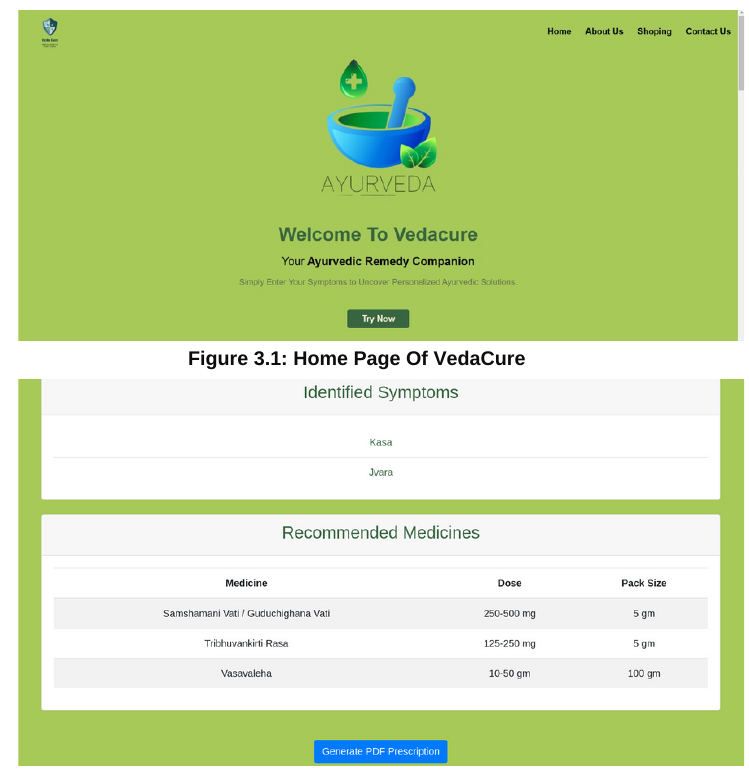

# Vedacure 🌿

Vedacure is a web application developed using Django and HTML, focused on providing information related to Ayurveda.

## Live Demo 🚀

The application is deployed and accessible via Vercel:  
[https://vedacure-phi.vercel.app/](https://vedacure-phi.vercel.app/)

## Screenshots 📸

  


## Features ✨

*   Provides information related to Ayurvedic treatments. 🩺  
*   User-friendly web interface. 💻  
*   Symptom analysis or remedy suggestion. 🌱  

## Technologies Used 🛠️

*   **Backend:** Django  
*   **Frontend:** HTML  
*   **Deployment:** Vercel  

## Project Structure 📂

Key files and directories in the repository include:  
*   `manage.py`: Django's command-line utility for administrative tasks.  
*   `requirements.txt`: Lists the Python package dependencies.  
*   `ayurveda/`, `data/`, `main/`: Application directories (containing specific Django apps).  
*   `vercel.json`: Configuration file for Vercel deployment.  
*   `.gitignore`: Specifies intentionally untracked files that Git should ignore.  

## Setup and Local Installation 🛠️

To run this project locally:

1.  **Clone the repository:**  
    ```
    git clone https://github.com/Rishirajverma29/Vedacure.git
    ```
2.  **Navigate to the project directory:**  
    ```
    cd Vedacure
    ```
3.  **(Optional but recommended) Create and activate a virtual environment:**  
    ```
    # On Windows
    python -m venv venv
    .\venv\Scripts\activate

    # On macOS/Linux
    python3 -m venv venv
    source venv/bin/activate
    ```
4.  **Install the required dependencies:**  
    ```
    pip install -r requirements.txt
    ```
    *(Note: Ensure you have Python and pip installed)*  
5.  **(Perform any necessary database migrations - typical for Django):**  
    ```
    python manage.py migrate
    ```
6.  **Start the development server:**  
    ```
    python manage.py runserver
    ```
7.  **Open your web browser** and navigate to `http://127.0.0.1:8000/`. 🌐  

## Contributing 🤝

Contributions are welcome! Please follow these general steps:  
1.  Fork the repository. 🍴  
2.  Create a new branch (`git checkout -b feature/YourFeatureName`).  
3.  Make your changes and commit them (`git commit -m 'Add some amazing feature'`).  
4.  Push to your branch (`git push origin feature/YourFeatureName`).  
5.  Open a Pull Request. 🚀  

## License 📜

This project is licensed under the MIT License. See the [LICENSE](LICENSE) file for details.  
